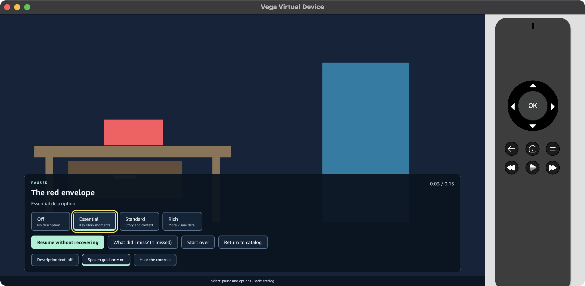
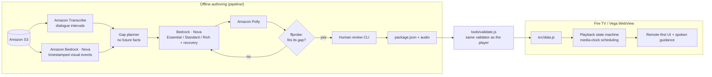

# Sema: audio description, your way (Fire TV / Vega OS)

**Sema lets blind and low-vision viewers choose how much of the picture they hear, and ask "What did I miss?" with one remote press.**

[](https://github.com/Jeremiah-Sakuda/sema-firetv/actions/workflows/ci.yml) [](LICENSE) · Fire TV track · AWS Builder mini-challenge · Build, Ship, Shape: Amazon Developer Hackathon 2026



*Sema on the Vega Virtual Device (Vega SDK 0.24). The focused level is outlined in yellow. A description that was interrupted is waiting to be recovered.*

---

## Why

Audio description (AD) fills the quiet moments of a film with what is happening on screen. Today it is one fixed track: the same amount of narration for everyone, every time. If you miss a line, you rewind and hope. Many films never get AD at all, because writing and recording it by hand is slow and expensive.

**Sema changes three things:**

1. **You choose the level of detail.** Essential gives key story moments, Standard adds context, and Rich adds the picture. Every level keeps every plot-critical fact; levels add detail, never contradictions.
2. **"What did I miss?"** pauses the film and describes the most recent visual moment again, often in more detail than your level gave you. It never describes anything that hasn't happened yet. Sema also tracks every critical story fact. If narration is interrupted (you paused, the film buffered, a cue couldn't fit), that fact stays recoverable until you hear it. It won't silently disappear.
3. **An AWS pipeline drafts the AD and a person approves it.** Amazon Transcribe finds the gaps between dialogue lines, Amazon Nova (on Bedrock) watches the film, and Amazon Polly voices three levels. Every line is **measured** to fit its gap, and a human reviewer approves every word before anything ships.

## Try it in two minutes (web build, no AWS account needed)

The player is a web app. The exact same files run inside the Fire TV (Vega) WebView.

```bash
npm install          # dev dependency only (jsdom, for tests)
npm test             # 37 player tests: state machine, package validation, remote/focus flows
npm start            # bundles, then serves http://127.0.0.1:4173
```

Use the keyboard as the remote:

| Key | Remote button |
|---|---|
| Arrow keys | D-pad |
| Enter | Select |
| Esc | Back |
| Space | Play/Pause |

Add `?debug` to the URL for the fault-injection and event-log panel. Add `?study=fixed` for the fixed-Standard comparison mode used in viewer sessions.

## Run it on Fire TV (Vega OS)

The full, tested steps are in **[docs/vega/BUILD-AND-RUN.md](docs/vega/BUILD-AND-RUN.md)**. In short:

```bash
npm run webm && npm run bundle && npm run vega:sync   # VP8 renditions, then copy the web app into vega-app/assets/
cd vega-app && npm install && npm run build:debug   # or scripts/build-staged.sh if your path has spaces
vega virtual-device start
vega run-app build/vpkg/sema_aarch64.vpkg com.sema.viewer.main
```

**[docs/vega/PLATFORM-FINDINGS.md](docs/vega/PLATFORM-FINDINGS.md)** records what we *measured* on the Vega Virtual Device:
- real remote key codes
- that `fetch()` cannot read `file://` assets
- how `speechSynthesis` behaves
- VoiceView focus tracking
- the VVD's H.264 playback limits

The app is built around those facts:
- Package data ships as a script, so there is no `fetch`.
- Spoken guidance uses pre-rendered Polly clips, with a watchdog on every utterance.
- Films ship as VP8 WebM on Vega, because H.264 stalls on the VVD.
- Nothing depends on the Menu key, which never reaches the WebView.

## How the remote works

Every screen always has a focused control, and every state change says where focus went ("Paused. What did I miss is selected."). That way a viewer who can't see the screen always knows what Select will do.

| You are… | You press | Sema does |
|---|---|---|
| Watching | **Select** (or any D-pad key) | Pauses, opens the controls, focuses **What did I miss?** |
| Watching | **Back** | Pauses, focuses **Return to catalog**; Back again leaves |
| Watching | **Play/Pause** | Pauses, focuses **Resume** |
| On **What did I miss?** | **Select** | Describes the most recent moment, or a pending interrupted one first; then focuses **Resume** |
| Paused | **Select** on a level | Switches level; the change applies from the next description |
| Anywhere | **Rewind / Fast-forward** | Seeks 5 s. Narration rebuilds at the new position; skipped facts are recorded as *skipped*, not as *heard* |

**Spoken guidance** reads focused controls and state changes using the same Polly voice as the narration. Any key press interrupts it. **VoiceView users** turn it off and hear everything through VoiceView instead; state changes then go to an ARIA live region.

Guidance never talks over the film: it speaks only while the film is paused.

**Adaptive suggestion:** if you ask "What did I miss?" twice in one scene, Sema offers Rich, while you're already paused. It makes the offer at most once per viewing.

## Architecture



**The player** (`src/`, plain JavaScript, no runtime dependencies):

- **`playback.js`** is a pure media-clock state machine.
  - It schedules narration from the video position, never wall-clock timers.
  - It checks the fit twice: when a cue is due, and when its audio actually starts.
  - If a cue is reached late, it falls back to a shorter *reviewed* variant instead of rushing.
  - It cancels stale audio callbacks via generation tokens.
  - It tracks each critical event as *not due → delivered / pending / bypassed*.
  - It keeps a versioned resume record.
- **`package.js`** rejects any package with future facts, dialogue overlap, unmeasured or ill-fitting audio, unsafe paths, or missing human approval.
- **`app.js`** contains the remote contract, focus guarantees, onboarding, resume and start-over, the adaptive suggestion, and error and retry states.
- **`voice.js`** handles spoken guidance: Polly clips first, speech synthesis as fallback, and a watchdog so nothing ever waits on a completion event.

**The authoring pipeline** (`pipeline/`, Python + boto3) is documented in **[pipeline/README.md](pipeline/README.md)**. That covers each AWS service's role, the IAM policy, live commands, the deterministic fit loop, and the optional **Strands Agents** fit-loop agent. Its 59 offline tests run with network access blocked.

## AWS services used (AWS Builder mini-challenge)

| Service | What it does in Sema |
|---|---|
| **Amazon S3** | Stores the authorized source film. Input for Transcribe and Nova; output location for Transcribe |
| **Amazon Transcribe** | Word-level timestamps, which become the dialogue intervals narration must never overlap |
| **Amazon Bedrock: Amazon Nova** | Watches the film (video input) and logs timestamped visual events and characters. Writes the three detail levels and spoiler-safe recovery cues. Rewrites lines that don't fit their gap |
| **Amazon Polly** (neural) | Voices every description level, recovery cue and UI prompt in one consistent voice |
| **Strands Agents SDK** (optional `--agent`) | Runs the fit loop as an agent with three tools: `render_with_polly`, `measure_duration` and `check_window`. The result comes from our own measurements, never from the agent's claim |

Measured cost, processing time and human review minutes per finished minute are in **[docs/FINDINGS.md](docs/FINDINGS.md)**.

## Evidence

- **Tests**
  - `npm test`: 37 player tests, including jsdom remote-flow tests that assert where focus lands after every transition.
  - `pipeline/`: 59 offline tests.
- **Platform**: [docs/vega/PLATFORM-FINDINGS.md](docs/vega/PLATFORM-FINDINGS.md), with screenshots and device logs.
- **Friction log**: [docs/FRICTION-LOG.md](docs/FRICTION-LOG.md). 21 real, reproducible issues with the Vega SDK, VVD and WebView, each with verbatim errors, a workaround and a suggestion.
- **Findings**: [docs/FINDINGS.md](docs/FINDINGS.md). Pipeline measurements, playback timing, viewer sessions, and what didn't work.

## Films and credits

The demo catalog uses excerpts of the Blender Foundation's open movies under **CC BY 3.0**. See [media/ATTRIBUTION.md](media/ATTRIBUTION.md) and `content/rights/`.

- *Sintel* (2010): © copyright Blender Foundation | durian.blender.org
- *Tears of Steel* (2012): (CC) Blender Foundation | mango.blender.org

The excerpts were re-encoded, and Sema's audio description was added. The Blender Foundation does not endorse this project. `npm run content:fetch` reproduces both excerpts from the official mirror.

## Limitations (honest)

- **On the Vega Virtual Device, H.264 and VP9 stall about 3 s in** (platform decoder path). Sema ships VP8/Opus WebM renditions, which play through, and selects them on Vega OS. We have not yet verified H.264 on physical Fire TV hardware.
- **VoiceView can be enabled on the VVD and tracks focus, but the VVD has no TTS engine.** VoiceView speech could only be verified on hardware.
- **AI drafts can miss brief actions or mis-describe them.** Every shipped line is human-approved, and the reviewer's edits are counted in FINDINGS.
- **This is a two-film pilot, not a catalog.** It doesn't integrate with Prime Video or any other streaming service.

## Repository map

```
index.html, style.css, src/      the player (bundled by tools/bundle.js into src/bundle.js + src/data.js)
media/                           packaged films, audio, prompts; media/catalog.json lists the catalog
pipeline/                        AWS authoring pipeline (Python), offline tests, IAM policy
vega-app/                        Vega OS (Fire TV) WebView app that hosts the player
tests/                           player unit + remote-flow tests
tools/                           bundle, serve, validate, posters, vega-sync, content fetch, Vega platform probe
docs/                            findings, friction log, Vega build/run + platform findings, submission drafts, planning history
```

## License

The code is under [MIT](LICENSE). The films are under CC BY 3.0 (see above).
