# Sema AD authoring pipeline (AWS)

This pipeline turns an authorized short film into a **human-reviewed, validated audio-description (AD) package** for the Sema player. The output has three detail levels (Essential, Standard, Rich) and a spoiler-safe "What did I miss?" recovery cue for every visual event.

It is a multi-service AWS pipeline: Amazon S3 → Amazon Transcribe → Amazon Bedrock (Amazon Nova) → Amazon Polly. A measured fit loop sits on top, and you can optionally run that loop as a Strands Agents agent. A mandatory human review gate comes before anything is published.

> **Status (2026-10-01): built and tested offline only.** No real AWS call has been made yet; spending has not been approved. All 59 tests pass with network access denied (a macOS `sandbox-exec` profile blocks it). The tests use stub clients that replay recorded-shape JSON responses. The fixture token counts are illustrative, not measured. Real numbers will come from the first `--live` run (see [Live run](#live-end-to-end-run-on-a-new-asset)).

## Architecture

```mermaid
flowchart LR
  SRC["Source film + rights record"] -->|ingest: sha256, upload| S3[("Amazon S3")]
  S3 -->|batch job, word timestamps| TR["Amazon Transcribe"]
  SRC -->|local, free| FF["ffmpeg: scene cuts + silencedetect"]
  TR --> WIN["Narration windows: dialogue gaps of 1.5 s or more"]
  FF --> WIN
  S3 -->|video block, S3 URI or bytes| OBS["Amazon Bedrock, Nova Pro: observe"]
  SRC -.->|"--frames N: timestamped JPEGs"| OBS
  OBS --> EV["Timestamped events + character refs"]
  WIN --> PLAN["Cue planner: no future facts, critical first"]
  EV --> PLAN
  PLAN --> SCR["Amazon Bedrock, Nova: Essential / Standard / Rich + recoveries"]
  SCR --> TTS["Amazon Polly neural TTS"]
  TTS --> MEAS["ffprobe: measured duration"]
  MEAS -->|too long| SHORT["Bedrock: shorten, keep critical facts (max 2 retries)"]
  SHORT --> TTS
  MEAS -->|fits| REV["Human review CLI: approve / edit / drop / play"]
  REV --> PKG["media/ASSET/package.json"]
  PKG --> VAL["node tools/validate.js (the player's own validator)"]
  VAL --> PLAYER["Sema player (Fire TV / Vega WebView)"]
```



The same flow as plain text:

```
film ─ingest─► S3 ─► Transcribe ──► dialogue spans ─┐
  │                                                 ├─► windows ─┐
  └──────────► ffmpeg (scenes, silence) ────────────┘            │
  S3/bytes ──► Bedrock Nova (observe) ──► events + characters ───┴─► cue planner
                                                                       │
        Bedrock (script: E/S/R variants + spoiler-safe recoveries) ◄───┘
                     │
                     ▼
     ┌─► Polly ─► ffprobe ─► fits? ── no ─► Bedrock "shorten" (≤2) ─┐
     └──────────────────────────────────────────────────────────────┘
                     │ yes / unresolved
                     ▼
           human review (blocking gate) ─► package.json ─► node validate.js ─► player
```

### What each AWS service does

| Service | Stage | Role | API calls |
|---|---|---|---|
| **Amazon S3** | ingest | Durable copy of the authorized source. It is the input for Transcribe and for Nova's S3 video input, and the output location for Transcribe. | `HeadBucket`, `CreateBucket` (only with `--create-bucket` or an interactive yes), `PutObject` (via `upload_file`), `GetObject` |
| **Amazon Transcribe** | analyze | Batch transcription with word-level timestamps, which become the dialogue intervals that narration must never overlap | `StartTranscriptionJob`, `GetTranscriptionJob` |
| **Amazon Bedrock (Nova Pro)** | observe | Watches the film (video block, or `--frames` image blocks). Logs timestamped visual events, criticality and stable character references as JSON | `Converse` |
| **Amazon Bedrock (Nova)** | script, render | Writes the three detail levels and the recoveries. In the fit loop, rewrites lines that are too long to speak in their window | `Converse` (the `--agent` mode uses `ConverseStream` through Strands) |
| **Amazon Polly** | render, review, prompts | Neural TTS (default `Joanna`, MP3 at 24 kHz) for every variant, recovery, reviewer edit and UI prompt | `SynthesizeSpeech` |

Every Bedrock request carries `requestMetadata` tags (`sema_tag`, `sema_asset`, `sema_stage`). If you turn on Bedrock model-invocation logging, you can filter the logs per asset and stage. The offline stub uses the same tag to find its recorded response. To switch tagging off, set `bedrock.request_metadata: false`.

### Fit loop: deterministic (default) and agent mode (`--agent`)

**Deterministic loop (default):**
1. Render with Polly.
2. Measure with ffprobe.
3. Check `duration + 2·margin + slack ≤ window`.
4. If the line doesn't fit, ask Bedrock to shorten it to `floor(words × available/measured × 0.9)` words while keeping the cue's critical facts. Then render and measure again.
5. After **2 retries**, the variant is marked `unresolved`. It becomes an `issues.json` entry, which is blocking for critical cues. The reviewer must then edit the line or drop the cue.

**Agent mode (`render --agent`, optional dependency `strands-agents`):**
- A Strands Agents agent runs the same loop through three tools:
  - `render_with_polly(text)`
  - `measure_duration(audio_path)`
  - `check_window(duration_seconds)`
- The agent rewrites the line itself between attempts and decides when to stop.
- Guardrails:
  - The render budget (`agent.max_renders`, default 3) is enforced *inside* the tool.
  - `measure_duration` only accepts paths that `render_with_polly` produced.
  - The final result is chosen from the tool ledger (our own ffprobe measurements), **never from the agent's claim**. The report counts any claim/ledger mismatches.
- Offline, a deterministic `OfflineAgentModel` stands in for the LLM. It shortens by truncating, not rewriting, so the Strands wiring is tested without Bedrock.

### Guarantees built into the pipeline

- **No future facts.** The validator requires `availableAt ≤ cue.start`. The planner may start a cue partway through a window, at the moment its event becomes visible, rather than skipping the window.
- **Spoiler-safe by construction.** The script model never sees the video. It receives only the events (and characters) visible at the cue start, or at the event's `availableAt` for recoveries. It cannot leak a later fact it was never given.
- **Critical events are never silently dropped.** An unplaceable critical event becomes a *blocking* issue. The reviewer must attach it to an eligible cue or downgrade it, with a recorded reason.
- **Fit is measured, not estimated.**
  - Durations come from ffprobe on the rendered MP3.
  - `fit_slack` (0.15 s) is added beyond the validator's margin. The player polls the media clock every ~30 ms, so a cue with zero headroom can be judged late at runtime.
- **Human approval gate.**
  - `reviewStatus: "approved"` is written only when review completes with no blockers.
  - `--approve-all` is recorded as such in the package's `approval.method` and `approval.note`, and the report warns that its review time is not a human measurement.
- **Consistency.**
  - Stages refuse to build on stale inputs. For example, re-running `observe` without re-running `script` blocks `render`, `review` and `package`.
  - A re-render after review restarts the review.
- **Offline by default.** Every command uses stubs unless you pass `--live`. `--live` asks for confirmation unless you also pass `--yes`. With `SEMA_FORBID_LIVE=1` (the tests set it), live clients can't be built at all.

## Setup

```bash
cd pipeline
/opt/homebrew/bin/python3 -m venv .venv          # tested with Python 3.14.7 (Homebrew)
.venv/bin/pip install -r requirements.txt         # boto3 1.43.107
.venv/bin/pip install -r requirements-agent.txt   # optional: strands-agents 1.57.2 for --agent
```

- **Python 3.14:** boto3 and strands-agents both installed and imported cleanly, so no older Python was needed. Python 3.12 and 3.13 are also present under `/opt/homebrew/bin` if a future dependency needs them.
- **Other requirements:** `ffmpeg`/`ffprobe` (at `/opt/homebrew/bin`) and `node` 18+ (for `tools/validate.js`).
- **Where to run:** run every command from `pipeline/`, either with `.venv/bin/python -m sema_pipeline …` or with `source .venv/bin/activate` first.

### Configuration

Precedence: built-in defaults < `pipeline/config.json` < environment variables < CLI flags.

To create a local config, copy `config.example.json` to `config.json`. `config.json` is gitignored.

| Variable | Meaning | Default |
|---|---|---|
| `SEMA_BUCKET` | S3 bucket for sources and Transcribe output (**required** for ingest) | none |
| `SEMA_REGION` | Region. Falls back to `AWS_REGION` / `AWS_DEFAULT_REGION` | `us-east-1` |
| `SEMA_OBSERVE_MODEL` | Video-capable Nova model or inference profile | `us.amazon.nova-pro-v1:0` |
| `SEMA_SCRIPT_MODEL` | Text model for scripts and shortening (e.g. `us.amazon.nova-lite-v1:0` is cheaper) | `us.amazon.nova-pro-v1:0` |
| `SEMA_AGENT_MODEL` | Model for `--agent` | `us.amazon.nova-pro-v1:0` |
| `SEMA_VOICE`, `SEMA_ENGINE` | Polly voice and engine | `Joanna`, `neural` |
| `AWS_PROFILE` etc. | Standard boto3 credential resolution. The pipeline never reads credential files itself | |

Other knobs live in `config.json`:
- dialogue merge gap and padding (0.6 / 0.1 s)
- minimum window (1.5 s)
- scene threshold (0.3)
- margin (0.2 s) and fit slack (0.15 s)
- words per second (2.6) and safety factor (0.85)
- level ratios (Essential 0.45, Standard 0.7, Rich 1.0 of the window budget)
- frame batch size
- the **price table** used for cost estimates

### Minimal IAM policy

Replace `BUCKET` and `ACCOUNT_ID`, and adjust the region if needed.

`InvokeModelWithResponseStream` is only needed for `--agent`. `s3:CreateBucket` is only needed if you let ingest create the bucket. `s3:ListBucket` is what `HeadBucket` requires.

```json
{
  "Version": "2012-10-17",
  "Statement": [
    { "Sid": "SemaBucket", "Effect": "Allow",
      "Action": ["s3:ListBucket", "s3:CreateBucket"],
      "Resource": "arn:aws:s3:::BUCKET" },
    { "Sid": "SemaObjects", "Effect": "Allow",
      "Action": ["s3:PutObject", "s3:GetObject"],
      "Resource": "arn:aws:s3:::BUCKET/sema/*" },
    { "Sid": "Transcribe", "Effect": "Allow",
      "Action": ["transcribe:StartTranscriptionJob", "transcribe:GetTranscriptionJob"],
      "Resource": "*" },
    { "Sid": "BedrockNova", "Effect": "Allow",
      "Action": ["bedrock:InvokeModel", "bedrock:InvokeModelWithResponseStream"],
      "Resource": [
        "arn:aws:bedrock:us-east-1:ACCOUNT_ID:inference-profile/us.amazon.nova-pro-v1:0",
        "arn:aws:bedrock:us-east-1:ACCOUNT_ID:inference-profile/us.amazon.nova-lite-v1:0",
        "arn:aws:bedrock:*::foundation-model/amazon.nova-pro-v1:0",
        "arn:aws:bedrock:*::foundation-model/amazon.nova-lite-v1:0"
      ] },
    { "Sid": "Polly", "Effect": "Allow",
      "Action": ["polly:SynthesizeSpeech"],
      "Resource": "*" }
  ]
}
```

Notes:
- `us.` inference profiles route requests across US regions (us-east-1, us-east-2 and us-west-2), which is why the foundation-model ARN uses a `*` region.
- Transcribe writes its output with *your* identity's permissions (`OutputBucketName`), and Bedrock reads S3 video the same way. That is why `PutObject` and `GetObject` are scoped to `sema/*`.

## Live end-to-end run on a new asset

Run this only after AWS spending is approved. Each `--live` command asks for confirmation; add `--yes` for unattended runs.

```bash
cd pipeline
export AWS_PROFILE=<your-profile>                  # or other standard credentials
export SEMA_REGION=us-east-1
export SEMA_BUCKET=sema-ad-<account-id>-us-east-1  # globally unique name
PY=.venv/bin/python

# 1. Upload, checksum and record rights. Creates the bucket if missing.
$PY -m sema_pipeline ingest  --live --asset my-short --create-bucket \
    --source ~/Movies/my-short.mp4 --rights ~/Documents/my-short-rights.txt \
    --title "My Short" --synopsis "Spoiler-free one-liner." --credits "Directed by A. Filmmaker"

# 2. Transcribe job + local ffmpeg scenes/silence -> narration windows
$PY -m sema_pipeline analyze --live --asset my-short

# 3. Nova Pro video understanding (add --frames 2 if brief actions are missed)
$PY -m sema_pipeline observe --live --asset my-short

# 4. Essential/Standard/Rich + recoveries. Check BLOCKING lines in the output.
$PY -m sema_pipeline script  --live --asset my-short

# 5. Polly + measured fit loop (or: render --live --agent)
$PY -m sema_pipeline render  --live --asset my-short

# 6. Human review. --live lets edits re-render with Polly.
$PY -m sema_pipeline review  --live --asset my-short --reviewer "Your Full Name"

# 7. Writes ../media/my-short/ and runs node tools/validate.js
$PY -m sema_pipeline package --asset my-short

# 8. Writes work/my-short/pipeline-report.{json,md}
$PY -m sema_pipeline report  --asset my-short

# 9. Writes ../media/prompts/*.mp3 + prompts.json (run once per voice change)
$PY -m sema_pipeline prompts --live
```

Steps 1 to 5 can also run as one command: `$PY -m sema_pipeline run --live --asset my-short --source … --rights … --title …`. It stops before human review.

Use `python -m sema_pipeline status --asset my-short` to check stage state and issues at any time.

**Outputs:**
- `../media/<asset>/package.json`
- `../media/<asset>/film.mp4`
- `../media/<asset>/audio/*.mp3`
- `../media/prompts/prompts.json` + MP3s

`package` writes into the real web root only when every automated stage ran `--live`. Offline or mixed runs go to `pipeline/out/` unless you pass `--web-root`.

**Recordings:** a live run saves every raw Bedrock response and the Transcribe JSON under `work/<asset>/recorded/`. Later offline runs of that asset replay them automatically, so you can iterate on planning and packaging without paying again.

## Running the tests (offline, free)

```bash
cd pipeline
.venv/bin/python -m unittest discover -s tests -t . -v

# Optional proof that nothing touches the network (macOS):
/usr/bin/sandbox-exec -p '(version 1)(allow default)(deny network*)' \
    .venv/bin/python -m unittest discover -s tests -t .
```

The 59 tests cover:
- dialogue merging, Transcribe parsing, scenes and window derivation
- event-to-cue assignment under availability constraints, critical-first ordering, and unplaced critical events
- word budgets and the fit rule including slack
- the fit loop with a fake renderer: first-try fit, shorten then fit, unresolved after 2 retries, and a shortener that makes no progress
- JSON extraction and repair, and observation validation
- the Strands agent loop: fit, and give-up at the render budget
- the prompt set
- the cost estimate, config precedence, and live-call safety switches
- an **offline end-to-end run**: CLI → stub S3/Transcribe/Bedrock/Polly → review (approve-all, interactive edit, blocking critical omission) → package → **`node tools/validate.js` passes in strict mode**

The end-to-end run uses:
- `media/fixture.mp4`
- the recorded-shape responses in `tests/fixtures/red-envelope/`
- sine-tone MP3s generated by ffmpeg. The stub Polly makes tone length track text length, so the fit loop behaves realistically. It never uses macOS `say`.

**Offline demo with the CLI** (writes to `pipeline/work/` and `pipeline/out/`):

```bash
SEMA_BUCKET=demo .venv/bin/python -m sema_pipeline run --asset demo --replay tests/fixtures/red-envelope \
  --source ../media/fixture.mp4 --rights "Test footage" --title "The red envelope" --scene-threshold 0.05
.venv/bin/python -m sema_pipeline review  --asset demo --reviewer "Your Name"   # interactive
.venv/bin/python -m sema_pipeline package --asset demo && .venv/bin/python -m sema_pipeline report --asset demo
```

## Cost estimates: caveats

`report` and the package's `pipeline.estimatedCostUSD` multiply **measured usage** by the `prices` table in config:
- Transcribe seconds, billed with a 15 s minimum
- Bedrock input/output tokens per model, from each response's `usage`
- Polly characters per engine
- S3 GB-month

Caveats:
- **These are estimates, not a bill.** The table was typed in by hand from memory on 2026-10-01 and is unverified. Check https://aws.amazon.com/pricing/ before quoting it.
- Free tier, credits, tax, S3 request fees and data transfer are ignored.
- Models that aren't in the table are listed as *unpriced*, never counted as $0.
- Cross-region inference profiles are priced as their base model.
- Video input tokens for Nova depend on the model's frame sampling and resolution. Expect the first real run to differ from the illustrative fixture counts.
- Rough order of magnitude for a 1-minute film (unverified, measure it): about $0.02 for Transcribe, a few cents for Nova Pro observe and script, and about $0.05 for Polly neural. That is well under $1, plus about $0.01 for the 23 UI prompts. `--frames 2` multiplies observe tokens by sending ~120 images per minute.

## Known limitations and risks

- **Model sampling can miss brief actions.**
  - Nova samples video frames itself (about 1 fps for short clips, per AWS docs at the time of writing), so a sub-second action can fall between samples. Video-mode timestamps are approximate.
  - `--frames N` mitigates this: ffmpeg frames at N fps, each labelled with its exact timestamp, sent in batches. It costs more tokens.
  - Neither mode is complete. **Human review is mandatory.** The pipeline will not publish without it, and `--approve-all` is recorded as such.
- **The observe model sees the whole film.** Its event *descriptions* could carry foreknowledge (e.g. "the thief"). The script stage hides later events, but the reviewer must still check wording for spoilers.
- **Nova video input limits (verify against current Bedrock docs).**
  - One video per request.
  - Inline bytes are capped by the ~25 MB request payload, so the pipeline sends bytes only for files ≤ 18 MB (`observe.inline_max_mb`) and an S3 URI otherwise.
  - Long videos are sampled more sparsely.
  - No audio understanding (dialogue comes from Transcribe).
  - If S3-sourced video fails through the `us.` cross-region profile, use inline bytes for short films, the in-region model id `amazon.nova-pro-v1:0`, or `--frames`.
- **Bedrock model access.** The account must be allowed to invoke Amazon Nova Pro (and Lite, if configured) in the region. Check Bedrock console → Model access if your account still shows that page. The first live call fails with `AccessDeniedException` otherwise. Nova and the `us.` profiles are available in us-east-1; other regions may differ.
- **Polly MP3 sample rate.** Polly offers MP3 at up to 24 kHz (44.1 kHz is not available for MP3), so narration is 24 kHz mono. The fixture's macOS audio was 44.1 kHz.
- **Essential level for cues with no critical event.** The player requires all three levels on every cue, so such cues get "the shortest useful phrase" at Essential. Reviewers can drop optional cues.
- **Transcribe treats sung lyrics as dialogue.** That shrinks narration windows. `silencedetect` sound spans are recorded per window (`soundOverlap`) for the reviewer but don't block cues.
- **The offline stubs are not the services.** Fixture responses are hand-authored in the real response shapes, and the stub "voice" is a sine tone. Offline runs are labelled `offline-stub` in the package and the report.
- **Not yet exercised live.** Live API usage was checked against botocore's bundled service models (request and response shapes), but the live path has not been executed. Expect first-run friction: model access, IAM, S3 region/owner for video, and token limits.

## Files

| Path | Purpose |
|---|---|
| `sema_pipeline/cli.py` | `python -m sema_pipeline` commands, live/offline service selection, freshness checks |
| `sema_pipeline/aws.py` | DI seam: `Services` container; live boto3 clients; stub S3/Transcribe/Bedrock/Polly |
| `sema_pipeline/timeline.py` | Pure timing logic: merging, windows, cue planning, budgets, fit rule |
| `sema_pipeline/{ingest,analyze,observe,script,render,review,package,report,prompts}.py` | The stages |
| `sema_pipeline/agent_fit.py` | Strands agent fit loop + offline stand-in model |
| `sema_pipeline/llm.py` | Converse wrapper: tagging, usage ledger, recording, JSON extraction/repair |
| `prompts.json` | UI prompt ids → texts (the 19 required + `delayed`, `start_over`, `prompts_on`, `prompts_off`) |
| `config.example.json` | Every config key with defaults and the price table |
| `tests/` | Offline tests; `tests/fixtures/red-envelope/` recorded-shape responses |
| `work/<asset>/` (gitignored) | `manifest`, `analysis`, `observations`, `script`, `issues`, `render`, `review`/`reviewed`, `usage.jsonl`, `run.json`, `pipeline-report.{json,md}`, `recorded/` |
